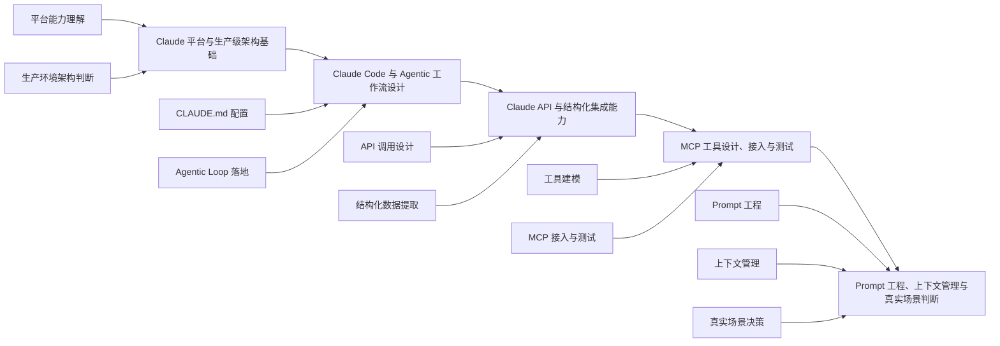

**语言：** 简体中文（当前） | [简体中文镜像](README.zh-CN.md) | [Português (Brasil)](docs/pt-BR/README.md) | [繁體中文](docs/zh-TW/README.md) | [日本語](docs/ja-JP/README.md) | [한국어](docs/ko-KR/README.md) | [Türkçe](docs/tr/README.md)

# awesome claude notes

[](https://github.com/loulanyue/awesome-claude-notes/stargazers)
[](https://github.com/loulanyue/awesome-claude-notes/network/members)
[](https://github.com/loulanyue/awesome-claude-notes/graphs/contributors)
[](https://www.npmjs.com/package/ecc-universal)
[](https://www.npmjs.com/package/ecc-agentshield)
[](https://github.com/marketplace/ecc-tools)
[](LICENSE)


> **50K+ stars** | **6K+ forks** | **30 contributors** | **7 种语言支持** | **Anthropic Hackathon 获奖项目**

---

**面向 AI agent harness 的性能优化系统。**

这不只是配置集合，而是一整套围绕 AI 编程代理工作流打造的生产级体系：技能、子代理、命令、规则、hooks、MCP 配置、持续学习、上下文压缩、安全审计，以及研究优先的开发方法。

它适用于 **Claude Code**、**Codex**、**Cowork**、**Cursor**、**OpenCode** 等多种代理平台或 IDE / CLI 组合。

如果你希望快速判断这个仓库是否适合自己，可以先看这三点：

- 你想把 AI coding agent 从“能用”提升到“稳定、可复用、可扩展”
- 你需要一套现成的 agents、skills、commands、rules、hooks 资产，而不是从零搭框架
- 你希望同一套方法能覆盖 Claude Code、Codex、Cursor、OpenCode 等多工具环境

## 快速导航

- [2 分钟快速开始](#-快速开始)
- [先读哪份指南](#指南)
- [仓库里有什么](#-仓库里有什么)
- [安装方式总览](#-安装方式)
- [常见问题](#-faq)
- [跨平台支持](#-跨平台支持)

> 说明：当前仓库默认以中文作为根 README 展示，`README.zh-CN.md` 为同步镜像，旧的 `docs/zh-CN/README.md` 保留为兼容入口。仓库名与文档示例现在统一使用 `awesome-claude-notes`；如果你在其他地方看到旧名字，多半是历史资料或旧安装残留。

---

## 指南

这个仓库更像“原始资产库”，真正解释理念与方法的内容主要在指南里。

<table>
<tr>
<td width="33%">
<a href="https://x.com/affaanmustafa/status/2012378465664745795">

</a>
</td>
<td width="33%">
<a href="https://x.com/affaanmustafa/status/2014040193557471352">

</a>
</td>
<td width="33%">
<a href="https://x.com/affaanmustafa/status/2033263813387223421">

</a>
</td>
</tr>
<tr>
<td align="center"><b>简明指南</b><br/>安装、基础理念、总体方法。<b>建议先看。</b></td>
<td align="center"><b>长文指南</b><br/>Token 优化、记忆持久化、评估体系、并行协作。</td>
<td align="center"><b>安全指南</b><br/>攻击面、沙箱、净化、CVE、AgentShield。</td>
</tr>
</table>

| 主题 | 你会学到什么 |
|------|--------------|
| Token 优化 | 模型选择、系统提示精简、后台进程控制 |
| 记忆持久化 | 跨会话自动保存 / 加载上下文的 hooks |
| 持续学习 | 从会话中自动提取可复用模式并沉淀为技能 |
| 验证闭环 | checkpoint、持续 eval、grader 类型、pass@k |
| 并行化 | Git worktrees、级联方法、何时扩展多实例 |
| 子代理编排 | 上下文不足问题、迭代式检索模式 |

---

## 🎓 Claude 官方认证架构师

hi，我是渔夫。

Claude 官方已经推出 **Claude 合作伙伴网络**，现在可以申请参加 **Claude 官方首个认证架构师证书考试**。这类认证面向的是使用 Claude 构建生产级应用的解决方案架构师，重点不在死记硬背，而在真实业务场景下的架构判断力。

对很多开发者和解决方案架构师来说，这张证书除了能系统梳理 Claude 相关能力，也可以作为后续跳槽、找工作时的加分项。

| 信息卡 | 说明 |
| --- | --- |
| 认证名称 | Claude 官方认证架构师 |
| 面向人群 | 使用 Claude 构建生产级应用的解决方案架构师 |
| 能力重点 | Claude Code、Agent SDK、Claude API、MCP、上下文管理 |
| 价值 | 提升生产级架构能力，也可作为求职 / 跳槽加分项 |
| 官方入口 | [申请访问考试](https://anthropic.skilljar.com/claude-certified-architect-foundations-access-request) |

### 这项认证主要覆盖什么

考试核心围绕以下基础能力展开，这些也是使用 Claude 构建生产级应用的关键技术：

- Claude Code
- Claude Agent SDK
- Claude API
- Model Context Protocol（MCP）
- 生产环境中的上下文管理、工具编排与架构设计能力

### 五大考察领域

- Claude 平台与生产级架构基础
- Claude Code 与 Agentic 工作流设计
- Claude API 与结构化集成能力
- MCP 工具设计、接入与测试
- Prompt 工程、上下文管理与真实场景判断

### 适合谁考 / 不适合谁考

| 适合谁考 | 不适合谁考 |
| --- | --- |
| 正在用 Claude 构建生产级应用的解决方案架构师 | 只想靠背题快速拿证、但不做实际项目的人 |
| 负责 Claude Code、Agent SDK、API、MCP 方案落地的技术负责人 | 还没有接触过 Claude 基础产品、也不打算动手实践的人 |
| 想把 Agentic 工作流、上下文管理、工具编排做成系统能力的人 | 只关注单次 Prompt 输出，不关心架构、系统设计和工程化的人 |
| 希望把官方认证作为简历亮点、职业背书的人 | 对生产环境稳定性、成本、上下文和工具治理没有兴趣的人 |

### 考试领域流程图



> 这版比思维导图更适合截图传播，也更适合放到社媒、课程页或知识星球里做单页配图。

### 备考建议（官方推荐方向）

1. 动手用 Agent SDK 构建完整的 Agentic Loop
2. 为真实项目配置 Claude Code，包括 `CLAUDE.md` 和 MCP
3. 设计并测试 MCP 工具
4. 构建结构化数据提取流水线
5. 练习 Prompt 工程技术
6. 研究上下文管理模式
7. 完成官方练习题

### 申请入口

需要先在官方页面填写申请，获得访问权限后再进入后续步骤：

👉 [Claude Certified Architect Foundations Access Request](https://anthropic.skilljar.com/claude-certified-architect-foundations-access-request)

### 大致流程

`链接申请` -> `完成资质声明` -> `解锁 Next Steps` -> `参加考试`

> 快速理解：
> 先申请访问资格，再完成平台里的资质声明，之后才会解锁后续学习与考试步骤。

> 注：上面的考试内容与流程说明基于当前项目整理时采用的资料与申请入口，具体安排请以官方页面最新说明为准。

---

## 最近更新

### v1.9.0 — 选择性安装与语言扩展（2026 年 3 月）

- 新增基于 manifest 的选择性安装架构，支持增量更新与状态跟踪
- 新增 6 个 reviewer / build resolver 代理，语言覆盖扩大到 10+
- 增加 PyTorch、文档检索、Bun、Next.js Turbopack 等新技能
- 引入 SQLite 状态存储、会话适配器与技能自进化基础设施
- 强化 orchestration、observer 可靠性和 CI

### v1.8.0 — Harness Performance System（2026 年 3 月）

- 项目定位从“配置包”升级为“agent harness 性能系统”
- 重构 hooks 可靠性与脚本运行方式
- 增加 `/harness-audit`、`/loop-start`、`/quality-gate`、`/model-route`
- NanoClaw v2、跨平台兼容性增强

### v1.7.0 — 跨平台扩展与演示生成（2026 年 2 月）

- 支持 Codex App + CLI
- 新增 `frontend-slides` 等业务 / 内容技能
- 强化 Cursor、Codex、OpenCode 多平台覆盖

### v1.6.0 — Codex CLI、AgentShield 与 Marketplace（2026 年 2 月）

- 新增 Codex CLI 支持
- 集成 AgentShield 安全扫描
- 上线 GitHub Marketplace

更多版本说明见 [Releases](https://github.com/loulanyue/awesome-claude-notes/releases)。

---

## 🚀 快速开始

推荐把上手流程理解成两件事：

1. 安装插件或工作流资产
2. 安装你所需语言的 rules / commands / skills

### 步骤 1：安装插件

```bash
# 添加 marketplace
/plugin marketplace add loulanyue/awesome-claude-notes

# 安装插件
/plugin install awesome-claude-notes@awesome-claude-notes
```

### 步骤 2：安装规则（必需）

> ⚠️ Claude Code 插件本身不能自动分发 `rules`，需要手动安装。

```bash
git clone https://github.com/loulanyue/awesome-claude-notes.git
cd awesome-claude-notes

# 安装依赖
npm install

# macOS / Linux
npx ecc typescript
# 或:
# npx ecc python
# npx ecc golang
# npx ecc swift
# npx ecc php
```

```powershell
# Windows PowerShell
npx ecc typescript

# 兼容旧入口
npx ecc-install typescript
```

### 步骤 3：开始使用

```bash
/awesome-claude-notes:plan "Add user authentication"

# 如果你是手动安装命令，也可以直接用短命令:
# /plan "Add user authentication"
```

✨ 安装完成后，你将获得大量 agents、skills、commands、rules 与 hooks。

### 推荐安装路径

| 你的目标 | 推荐方式 | 适合场景 |
|------|------|------|
| 先快速用起来 | 插件安装 + `npx ecc <language>` | 大多数 Claude Code 用户 |
| 精简安装内容 | `npx ecc install --profile ...` | 想按模块控制安装范围 |
| 完全手动管理 | 复制目录 | 对目录结构和配置合并有强控制需求 |

---

## 🌐 跨平台支持

本项目覆盖 **Windows、macOS、Linux**，并支持多个主流 AI 编码平台：

- Claude Code
- Cursor
- Codex macOS App + CLI
- OpenCode
- Antigravity

所有 hooks 和脚本都尽量采用跨平台实现，重点使用 Node.js 以减少平台差异。

### 包管理器检测

系统会自动按以下优先级检测包管理器：

1. 环境变量 `CLAUDE_PACKAGE_MANAGER`
2. 项目级 `.claude/package-manager.json`
3. `package.json` 中的 `packageManager`
4. 锁文件
5. 全局配置 `~/.claude/package-manager.json`
6. 回退到第一个可用包管理器

示例：

```bash
export CLAUDE_PACKAGE_MANAGER=pnpm
node scripts/setup-package-manager.js --global pnpm
node scripts/setup-package-manager.js --detect
```

### Hook 运行时控制

```bash
export ECC_HOOK_PROFILE=standard
export ECC_DISABLED_HOOKS="pre:bash:tmux-reminder,post:edit:typecheck"
```

---

## 📦 仓库里有什么

这个仓库本质上是一套 **Claude Code 插件 + 通用代理工作流资产**。

### 主要目录

- `.claude-plugin/`
  插件与 marketplace 清单
- `agents/`
  专用子代理定义，例如 planner、architect、code-reviewer、security-reviewer、build resolver 等
- `skills/`
  工作流与领域知识模块，覆盖前端、后端、Python、Go、Spring Boot、Django、Laravel、Docker、评估、安全等
- `commands/`
  Slash commands，例如 `/plan`、`/tdd`、`/code-review`、`/build-fix`
- `rules/`
  常驻约束，分为 `common/` 与语言专属规则
- `hooks/`
  各类事件触发自动化
- `scripts/`
  跨平台 Node.js 脚本
- `contexts/`
  动态上下文注入
- `examples/`
  示例配置
- `mcp-configs/`
  MCP server 配置
- `tests/`
  测试套件

### 代表性能力

- 28+ specialized agents
- 100+ skills
- 60+ commands
- 多语言 rules
- 安全扫描与持续学习
- 多平台安装与适配

---

## 🛠️ 生态工具

### Skill Creator

提供两种从仓库历史自动生成技能的方式：

#### 方式 A：本地分析

```bash
/skill-create
/skill-create --instincts
```

它会分析 git 历史并生成 SKILL.md。

#### 方式 B：GitHub App

适合超大仓库、自动提 PR、团队共享：

[Install GitHub App](https://github.com/apps/skill-creator) | [ecc.tools](https://ecc.tools)

### AgentShield

用于扫描 Claude Code / agent 配置中的安全问题、注入风险与误配置。

```bash
npx ecc-agentshield scan
npx ecc-agentshield scan --fix
npx ecc-agentshield scan --opus --stream
npx ecc-agentshield init
```

它可检查：

- `CLAUDE.md`
- `settings.json`
- MCP 配置
- hooks
- agents
- skills

输出可用于终端、JSON、Markdown、HTML，且可作为 CI gate。

### Continuous Learning v2

基于 instinct 的持续学习系统：

```bash
/instinct-status
/instinct-import <file>
/instinct-export
/evolve
```

---

## 📋 环境要求

### Claude Code CLI 版本

最低要求：**v2.1.0 或更高**

```bash
claude --version
```

### Hooks 自动加载说明

> ⚠️ 对贡献者尤其重要：不要在 `.claude-plugin/plugin.json` 里显式添加 `"hooks"` 字段。

Claude Code v2.1+ 会自动加载插件中的 `hooks/hooks.json`。手动再声明会触发重复检测错误。

---

## 📥 安装方式

### 方式 1：作为插件安装（推荐）

```bash
/plugin marketplace add loulanyue/awesome-claude-notes
/plugin install awesome-claude-notes@awesome-claude-notes
```

然后安装当前项目需要的语言或 profile：

```bash
npx ecc typescript
# 或
npx ecc install --profile developer --target claude
```

你也可以直接在 `~/.claude/settings.json` 中启用 marketplace 与插件。

> 注意：rules 仍需手动安装，因为插件系统本身不支持自动分发 rules。

### 方式 2：手动安装

如果你想完全控制安装内容：

```bash
git clone https://github.com/loulanyue/awesome-claude-notes.git

# agents
cp awesome-claude-notes/agents/*.md ~/.claude/agents/

# rules
cp -r awesome-claude-notes/rules/common/* ~/.claude/rules/
cp -r awesome-claude-notes/rules/typescript/* ~/.claude/rules/

# commands
cp awesome-claude-notes/commands/*.md ~/.claude/commands/

# skills
cp -r awesome-claude-notes/skills/* ~/.claude/skills/
```

另外还需要把 `hooks/hooks.json` 和 `mcp-configs/mcp-servers.json` 中需要的内容同步到你的本地配置。

### 方式 3：Selective Install

如果你不想一次装完整套资产，可以使用新的选择性安装入口：

```bash
npx ecc install --profile developer --target claude
npx ecc install --modules core-rules,typescript-commands --target cursor
npx ecc plan --profile developer --target claude
```

这条路径更适合团队内渐进接入、做差异化安装，或需要先 dry-run 再落地的场景。

---

## 🎯 核心概念

### Agents

用于被委派的小范围任务，例如代码审查、架构设计、构建错误修复、文档查阅。

### Skills

工作流定义，可以由命令或代理调用，通常描述一组固定的方法论或步骤。

### Hooks

在工具事件发生时触发自动行为，例如：

- 编辑后自动格式化
- 提交前检查 secrets
- 执行 shell 前阻止危险行为

### Rules

始终生效的约束，通常分成：

- `common/`：语言无关规则
- `typescript/`
- `python/`
- `golang/`
- `swift/`
- `php/`

---

## 🗺️ 应该用哪个 Agent / Command

| 我想做什么 | 建议命令 | 对应能力 |
|-----------|---------|---------|
| 规划新功能 | `/plan "Add auth"` | planner |
| 测试先行开发 | `/tdd` | tdd-guide |
| 审查刚写好的代码 | `/code-review` | code-reviewer |
| 修复构建失败 | `/build-fix` | build-error-resolver |
| 跑端到端测试 | `/e2e` | e2e-runner |
| 查安全问题 | `/security-scan` | security-reviewer |
| 清理死代码 | `/refactor-clean` | refactor-cleaner |
| 更新文档 | `/update-docs` | doc-updater |

### 常见工作流

**新功能开发**

```text
/plan -> /tdd -> 实现 -> /code-review
```

**修 bug**

```text
/tdd -> 先写复现测试 -> 修复 -> /code-review
```

**发布前检查**

```text
/security-scan -> /e2e -> /test-coverage
```

---

## ❓ FAQ

### 如何查看已安装的 agents / commands / skills？

```bash
/plugin list awesome-claude-notes@awesome-claude-notes
```

如果你是通过 Node 安装器接入，也可以运行：

```bash
npx ecc list-installed
```

### hooks 不工作，或者报 Duplicate hooks file？

最常见原因就是你手动在 `.claude-plugin/plugin.json` 中声明了 `"hooks"` 字段。删掉它。

### 可以只装一部分吗？

可以。你有三种方式：

- 手动复制你需要的目录，例如只装 agents 或只装 rules
- 使用 `npx ecc install --profile ...` 按预设 profile 安装
- 使用 `npx ecc install --modules ...` 精确到模块级安装

### 支持 Cursor / OpenCode / Codex / Antigravity 吗？

支持，而且这个项目专门做了跨工具适配。

### 为什么有些旧资料里还会出现旧仓库名？

因为这个项目经历过仓库品牌切换，部分旧截图、旧文章和历史讨论仍会引用旧名字；当前仓库与本文档中的安装示例已经统一使用 `awesome-claude-notes`。

---

## 🧪 运行测试

```bash
node tests/run-all.js
node tests/lib/utils.test.js
node tests/hooks/hooks.test.js
```

---

## 🤝 参与贡献

欢迎贡献，而且非常欢迎。

你可以贡献：

- 新 agent
- 新 skill
- 新 hooks
- 更好的 rules
- 新语言或新框架支持
- 文档和翻译

详见 [CONTRIBUTING.md](CONTRIBUTING.md)。

---

## Cursor IDE 支持

项目已提供完整的 Cursor 适配，包括：

- rules
- hooks
- AGENTS.md
- skills
- commands
- MCP configs

快速开始：

```bash
./install.sh --target cursor typescript
```

---

## Codex macOS App + CLI 支持

项目也提供 Codex 的一等支持。

快速开始：

```bash
codex
npm install && bash scripts/sync-ecc-to-codex.sh
```

包含内容：

- `.codex/config.toml`
- 根目录 `AGENTS.md`
- `.codex/AGENTS.md`
- `.codex/agents/`
- 共享 skills
- MCP server 自动合并脚本

Codex 当前的主要限制是：**没有 Claude 风格的 hooks 完整对等能力**，因此更多依赖 `AGENTS.md`、sandbox 权限和 instruction 文件来实现约束。

---

## 🔌 OpenCode 支持

项目提供完整的 OpenCode 支持，包括插件与 hooks。

快速开始：

```bash
npm install -g opencode
opencode
```

OpenCode 的插件事件实际上比 Claude Code 更多，因此在某些 hook 场景下反而更强。

---

## Cross-Tool Feature Parity

ECC 的一个核心目标，就是尽可能把多种主流 AI coding tool 拉到同一个高质量工作流层级。

| 功能 | Claude Code | Cursor | Codex | OpenCode |
|------|-------------|--------|-------|----------|
| Agents | 强 | 共享 AGENTS.md | 共享 AGENTS.md | 强 |
| Commands | 强 | 共享 | 指令为主 | 强 |
| Skills | 强 | 共享 | 原生格式支持 | 强 |
| Hooks | 强 | 很强 | 弱 | 很强 |
| Rules | 强 | 强 | 指令式 | 中 |
| MCP Servers | 强 | 共享 | 支持 | 强 |

---

## 📖 背景

作者自 Claude Code 早期实验阶段起就持续使用这套体系，并在 2025 年 9 月的 Anthropic x Forum Ventures Hackathon 中获奖。相关配置已经在多个真实生产项目中长期打磨。

---

## Token 优化

如果你不主动管理 token，Claude Code 的成本会很高。这套仓库中有大量策略就是围绕“更便宜但不明显掉质”来设计的。

### 推荐设置

```json
{
  "model": "sonnet",
  "env": {
    "MAX_THINKING_TOKENS": "10000",
    "CLAUDE_AUTOCOMPACT_PCT_OVERRIDE": "50"
  }
}
```

| 设置 | 默认值 | 推荐值 | 作用 |
|------|--------|--------|------|
| `model` | opus | `sonnet` | 大幅降低成本 |
| `MAX_THINKING_TOKENS` | 31999 | `10000` | 降低隐藏思考成本 |
| `CLAUDE_AUTOCOMPACT_PCT_OVERRIDE` | 95 | `50` | 更早 compact，提升长会话质量 |

### 日常建议

- 默认用 Sonnet
- 复杂架构问题再切 Opus
- 无关任务之间用 `/clear`
- 在逻辑断点用 `/compact`
- 用 `/cost` 监控成本

### MCP 数量控制

不要一次启用太多 MCP。每个 MCP 工具描述都会吃上下文窗口。

- 每个项目尽量少于 10 个 MCP
- 活跃工具尽量少于 80 个

---

## ⚠️ 重要说明

### 关于自定义

这套配置并不是“必须原样照搬”。

建议方式是：

1. 先安装并运行起来
2. 保留你真正喜欢的部分
3. 删除你不会用的部分
4. 再逐步加上你自己的模式

---

## 💜 Sponsors

[成为赞助者](https://github.com/sponsors/affaan-m) | [赞助档位](SPONSORS.md) | [赞助说明](SPONSORING.md)

---

## 🌟 Star History

[](https://star-history.com/#loulanyue/awesome-claude-notes&Date)

---

## 🔗 链接

- [简明指南](https://x.com/affaanmustafa/status/2012378465664745795)
- [长文指南](https://x.com/affaanmustafa/status/2014040193557471352)
- [安全指南](./the-security-guide.md)
- [作者 X 主页](https://x.com/affaanmustafa)

---

## 📄 许可证

MIT

可自由使用、修改和扩展；如果它对你有帮助，也欢迎回馈社区。

---

**如果这个仓库对你有帮助，欢迎点个 Star。**
